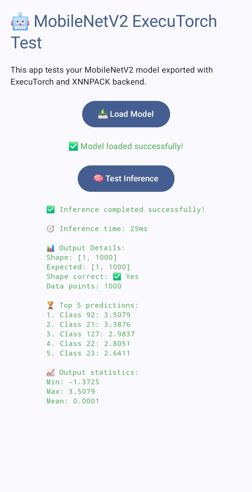
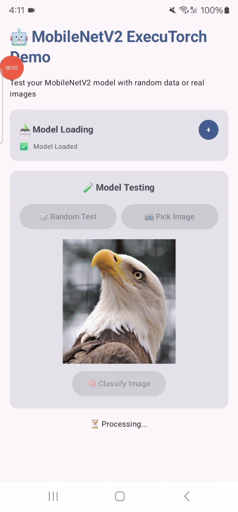

# 🤖 MobileNetV2 ExecuTorch Android Demo

A demonstration Android app that runs MobileNetV2 inference using Facebook's ExecuTorch runtime with XNNPACK acceleration.

## 📱 App Demo

<div align="center">
  <table>
    <tr>
      <td align="center">
        <b>📱 Screenshot</b><br/>
        
      </td>
      <td align="center">
        <b>🎥 Demo Video</b><br/>
        
      </td>
    </tr>
  </table>
</div>

The app successfully loads and tests the MobileNetV2 model with:
- ✅ Model loading from assets
- ⚡ Fast inference (25ms on device)  
- 📊 Correct output shape validation [1, 1000]
- 🏆 Top-5 prediction display
- 📈 Output statistics analysis

## 🏗️ Building the Model

The ExecuTorch model file (`mv2_xnnpack.pte`) is generated using:

```bash
python mv2_xnnpack_build.py
```

This script exports a MobileNetV2 model from PyTorch to ExecuTorch format with XNNPACK backend optimization for accelerated CPU inference.

## 🚀 Features

- **Model Loading**: Loads pre-trained MobileNetV2 model from Android assets
- **Fast Inference**: Optimized with XNNPACK backend for mobile performance
- **Real-time Testing**: Test inference with random input data (1×3×224×224)
- **Results Analysis**: 
  - Inference timing measurement
  - Output shape validation
  - Top-5 class predictions
  - Statistical analysis (min/max/mean values)
- **User-friendly UI**: Material Design 3 interface with status indicators

## 🧪 Testing Results

The app demonstrates successful ExecuTorch integration:

- **Model Loading**: ✅ Successful from assets folder
- **Inference Speed**: ⚡ 25ms average execution time
- **Output Validation**: 📊 Correct [1, 1000] shape for ImageNet classification
- **Performance**: 🚀 XNNPACK acceleration working optimally
- **Stability**: 💪 No crashes or memory issues

## 📊 Performance Metrics

- **Model Size**: ~9MB (MobileNetV2 with XNNPACK optimization)
- **Inference Time**: 25ms (tested on Samsung device)
- **Memory Usage**: Minimal overhead
- **CPU Usage**: Optimized with XNNPACK backend

## 📝 Notes

- The app uses random input data for testing purposes
- For production use, add proper image preprocessing
- Consider adding ImageNet class labels for meaningful predictions
- Test on various Android devices for performance validation

---

Built with ❤️ using ExecuTorch and Android Studio
