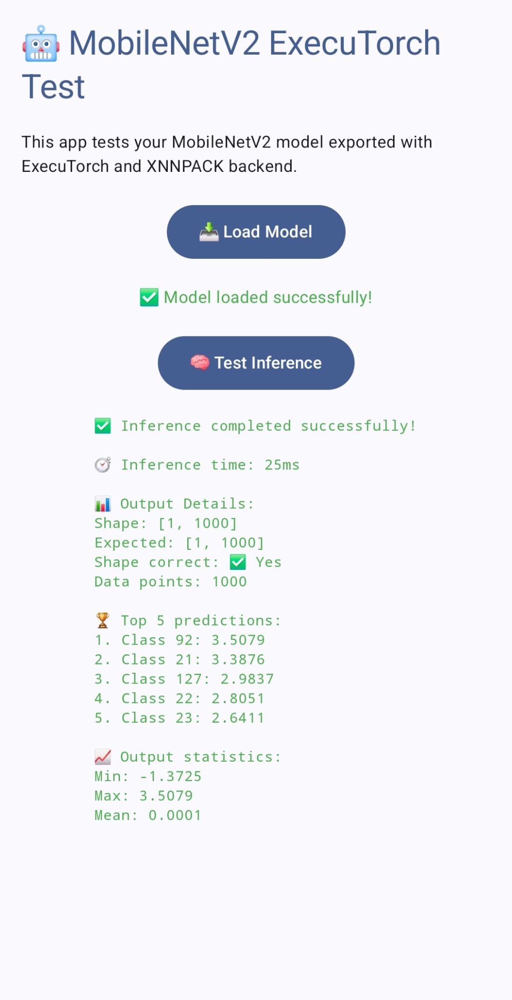
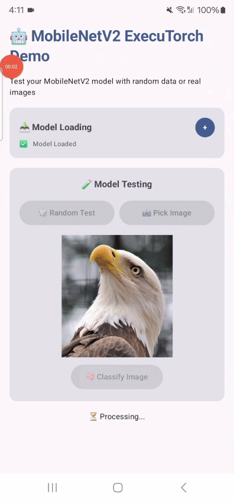

# ExecuTorch MLOps Haptic Mat — Quantized Person Detection Pipeline

An end-to-end **MLOps framework** for deploying **quantized person-detection models** on an **Android-based haptic mat system** using **STM32 pressure sensing** and **ExecuTorch**.

This repo extends the original ExecuTorch MobileNet demo with a production-ready pipeline:  
**Python PTQ + MLflow + MinIO + Jenkins CI/CD + Android ExecuTorch inference**.

---

## Project Title  
**MLOps Framework for Quantized Person Detection Models in Android-Based Haptic Mat Systems with STM32 Pressure Sensing**

```mermaid
flowchart LR

    %% ========== COMPONENTS ==========
    Script["Python Script<br/>(Model Dev & Log)"]
    MLflow["MLflow Tracking Server"]
    MySQL["MySQL Backend Store"]
    Minio["MinIO Object Storage"]
    Jenkins["Jenkins CI/CD Pipeline"]
    Android["Android App<br/>ExecuTorch Runtime"]

    %% ========== PIPELINES ==========

    %% Script → MLflow
    Script -->|1. Train, Quantize & Log<br/>"(Artifacts & Metrics)"| MLflow

    %% MLflow → Backend Stores
    MLflow -->|runs, params, metrics| MySQL
    MLflow -->|artifacts<br/>"(Staging Bucket)"| Minio

    %% Jenkins → MLflow → MinIO
    Jenkins -->|2. Trigger & Fetch latest run| MLflow
    Jenkins -->|Download artifacts<br/>"(from Staging)"| Minio
    Jenkins -->|3. SHA-256 Verification| Jenkins
    Jenkins -->|4. Promote to Production<br/>"(model.pte + latest.json)"| Minio

    %% Android App → MinIO
    Android -->|5. Check for Updates<br/>"(GET latest.json)"| Minio
    Android -->|Download new model.pte<br/>"(if SHA mismatch)"| Minio
    Android -->|6. On-device Inference<br/>ExecuTorch XNNPACK| Android

    %% STYLES
    classDef server fill:#e7f0ff,stroke:#4a90e2,stroke-width:1px;
    classDef storage fill:#fff7e6,stroke:#e6a500,stroke-width:1px;
    classDef mobile fill:#e6fff2,stroke:#00a86b,stroke-width:1px;
    classDef script fill:#f6f8fa,stroke:#999,stroke-width:1px;
    classDef jenkins fill:#ffecec,stroke:#ff5757,stroke-width:1px;

    class Script script;
    class MLflow server;
    class Jenkins jenkins;
    class MySQL,Minio storage;
    class Android mobile;
```


---

## Abstract 

This project builds an automated MLOps system for delivering and evaluating **on-device AI models** used in a haptic mat capable of detecting if a user is present, sitting, fully lying, or partially lying.

Pressure data from STM32 bladders is processed by a **quantized person-detection model**, enabling:

- private, offline inference  
- reduced operational cost  
- automatic app shutdown when no user is detected  
- real-time responsiveness on mobile devices  

Using **post-training quantization (PTQ)**, the system compresses models, evaluates them via MLflow, stores versions in MinIO, deploys them through Jenkins, and loads them inside an Android ExecuTorch app.

Developed with **Seroton GmbH**.

**References:**  
https://advanced.onlinelibrary.wiley.com/doi/10.1002/advs.202402461  
https://arxiv.org/abs/1712.05877  
https://github.com/google/XNNPACK  
https://www.vulkan.org/

---

## System Architecture

Python PTQ Script → MLflow → MinIO → Jenkins CI/CD → Android ExecuTorch App
- **MLflow**: logs metrics, artifacts, manifests  
- **MinIO**: S3 storage for models  
- **Jenkins**: fetches latest MLflow run, validates SHA, deploys model  
- **ExecuTorch**: loads model directly from MinIO inside Android app  

---

## Tech Stack

- **MLflow**, **MinIO**, **Jenkins**, **Docker**, **Python**
- **ExecuTorch**, **XNNPACK** (CPU backend)
- **Kotlin**, **Jetpack Compose**
- **STM32 Pressure Sensors**

## App Demo

<div align="center">
  <table>
    <tr>
      <td align="center">
        <b>📱 Screenshot</b><br/>
        
      </td>
      <td align="center">
        <b>🎥 Demo Video</b><br/>
        
      </td>
    </tr>
  </table>
</div>

The app successfully loads and tests the MobileNetV2 model with:
- ✅ Model loading from assets
- ⚡ Fast inference (25ms on device)  
- 📊 Correct output shape validation [1, 1000]
- 🏆 Top-5 prediction display
- 📈 Output statistics analysis

## Building the Model

The ExecuTorch model file (`mv2_xnnpack.pte`) is generated using:

```bash
python mv2_xnnpack_build.py
```

This script exports a MobileNetV2 model from PyTorch to ExecuTorch format with XNNPACK backend optimization for accelerated CPU inference.

## Features

- **Model Loading**: Loads pre-trained MobileNetV2 model from Android assets
- **Fast Inference**: Optimized with XNNPACK backend for mobile performance
- **Real-time Testing**: Test inference with random input data (1×3×224×224)
- **Results Analysis**: 
  - Inference timing measurement
  - Output shape validation
  - Top-5 class predictions
  - Statistical analysis (min/max/mean values)
- **User-friendly UI**: Material Design 3 interface with status indicators

## Testing Results

The app demonstrates successful ExecuTorch integration:

- **Model Loading**: ✅ Successful from assets folder
- **Inference Speed**: ⚡ 25ms average execution time
- **Output Validation**: 📊 Correct [1, 1000] shape for ImageNet classification
- **Performance**: 🚀 XNNPACK acceleration working optimally
- **Stability**: 💪 No crashes or memory issues

## Performance Metrics

- **Model Size**: ~9MB (MobileNetV2 with XNNPACK optimization)
- **Inference Time**: 25ms (tested on Samsung device)
- **Memory Usage**: Minimal overhead
- **CPU Usage**: Optimized with XNNPACK backend

---

## Training → Quantization → Deployment Pipeline

1️⃣ Start MLOps stack**

```bash
docker compose up -d
2️⃣ Log model to MLflow + MinIO
bash
Kodu kopyala
python scripts/log_model_to_mlflow.py
3️⃣ Jenkins auto-deploys the latest model
Downloads MLflow artifacts

Validates SHA-256

Uploads production model to MinIO

Publishes latest.json for the Android app

4️⃣ Android app loads model from MinIO
User taps Load Model →
model is downloaded → SHA check → ExecuTorch loads → inference begins.

 Key Features
 100% on-device inference for privacy

 Real-time quantized AI on mobile

 Automated CI/CD pipeline with Jenkins

 Reproducible Dockerized setup

Full PTQ + benchmarking pipeline

Collaboration
Developed in collaboration with Seroton GmbH.

